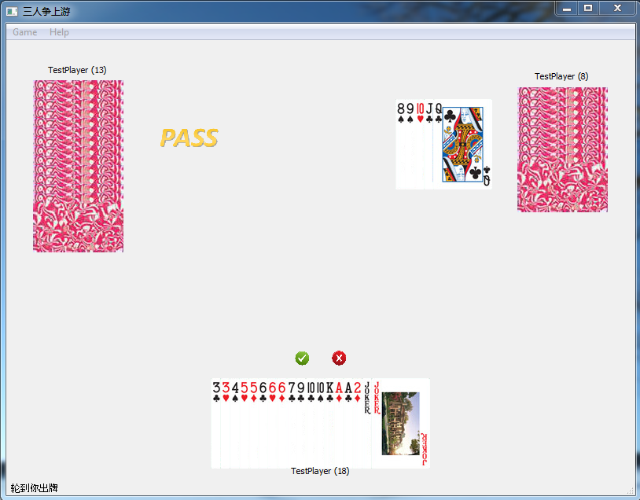

# Chinese Card Game "争上游"
## Overview
- 3-person 争上游 game with one set of (54) cards
- played over the network
- written in Python3.4 + PyQt5.5

## Instructions
1. Run `python card_server.py` to start the server.
2. Run `python card_client.py` to start the client. Using the menu (or shortcut keys), connect to the server and hit "start game". Remember to change ip and port number beforehand. (I plan to make it a config file later)
3. Once 3 people have hit "start game", the game will automatically start.
4. When each round of game is over, hit "start game" again.

## Game Rules
| Allowed Card Set | Example |
|:----------------:|:-------:|
| 单张             | 3, 4 |
| 对子             | 33, 44 |
| 三张             | 333, 444 |
| 三带一           | 3334, JJJ3 |
| 三带二           | 33344, JJJ33 |
| 顺子(5张以上)    | A2345, TJQKA, 3456789 |
| 姐妹对(3对以上)  | AA2233, QQKKAA, 33445566 |
| 光飞             | AAA222, KKKAAA, 333444555 |
| 飞机             | AAA2223344, KKKAAA5566, 333444555778899 |
| 四带二           | 333357, 222234 |
| 炸弹             | 3333, 4444 |

Written by Xudong
2016-05-02